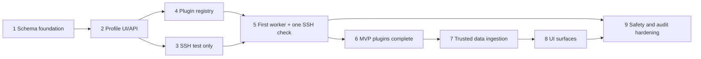
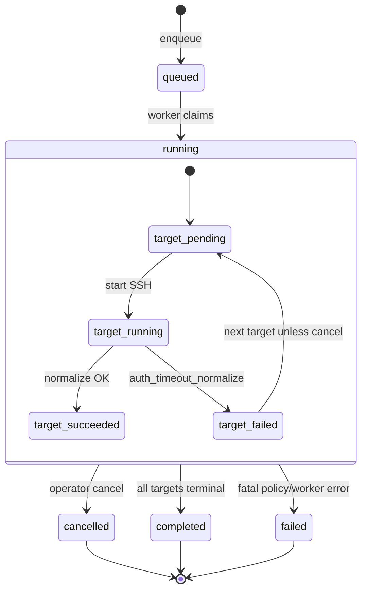

# Credentialed Checks Engine — MVP implementation plan

This document is a **staged implementation plan** for the MVP described in [Credentialed Checks Engine — design](CREDENTIALED_CHECKS_ENGINE.md). It breaks work into **small slices** with **validation gates**. It does not prescribe calendar sequencing beyond slice order dependencies.

**Capability anchors**

- Additive schema and APIs only; no replacement of scan or Zabbix flows.
- **Observations first** for trusted data; **no direct `asset_assertions` writes** from the executor ([Trusted data model](TRUSTED_DATA_MODEL.md)).
- No arbitrary command execution, no auto-remediation, no plugin marketplace, no broad credential reuse without **scope binding** enforced in API.
- Secrets never in API responses, UI fields, or unstructured logs.

**Design reference:** [CREDENTIALED_CHECKS_ENGINE.md](CREDENTIALED_CHECKS_ENGINE.md)

---

## Slice dependency overview



*Note:* Slice 3 (SSH test) and slice 4 (registry) can proceed in parallel after slice 2; slice 5 requires both.

---

## Run and target state machine (worker)



---

## Slice 1 — Schema and settings foundation

### Purpose

Land **additive** SQLite tables and indexes so later slices can store profiles, plugins, jobs, runs, results, and artifacts **without any execution path**. Establish a single migration gate (e.g. `config.migration_cred_checks_v1` or equivalent pattern used in `api/db.php`) so deploys are idempotent.

### Files likely involved

- `api/db.php` — idempotent `CREATE TABLE IF NOT EXISTS`, migration flag, optional `PRAGMA`/indexes.
- `docs/CREDENTIALED_CHECKS_ENGINE.md` — §6 alignment (no doc drift for column names once frozen in slice 1).

### Schema / API changes

**Tables (MVP minimal):**

| Table | MVP role |
|-------|-----------|
| `credential_check_plugins` | Seed rows for built-in manifests (slice 4 can populate). |
| `credential_profiles` | Transport, `principal_json`, `secret_ciphertext`, `scope_json`, audit columns, `last_test_*`. |
| `credential_check_jobs` | `target_mode`, `target_json`, `plugin_selection_json`, `policy_json`, `enabled`. |
| `credential_check_runs` | `job_id` nullable, `status`, `summary_json`, `initiated_by`, timestamps. |
| `credential_check_run_targets` | **Recommended** for per-target status (cleaner than overloading `runs`). |
| `credential_check_results` | `run_id`, `asset_id`, `plugin_key`, `plugin_version`, `status`, `normalized_json`, `metrics_json`. |
| `credential_check_artifacts` | Optional in slice 1 if slice 5 stores stdout to DB; otherwise defer blob table and use `results.normalized_json` only until artifact path exists. **Plan:** create table with `blob` OR `storage_path` nullable; MVP can write small redacted stdout into artifact row with size cap. |

**Settings (optional slice 1 or 2):**

- Global caps: `cred_check_max_concurrency`, `cred_check_default_timeout_ms`, `cred_check_max_output_bytes` in existing `config` key pattern or dedicated keys.

### Security risks

- Empty migration gives **false confidence** if tables exist but RLS/RBAC not wired yet — mitigate with **no public API** until slice 2.
- `secret_ciphertext` column present without encryption key → treat as **blocker** for slice 2 writes (document key source: env var).

### Validation steps

- Fresh DB: open app, migrations run once, tables present (`sqlite3` / admin query).
- Repeat open: migration flag prevents duplicate DDL errors.
- `php -l` on touched PHP files.

### Rollback considerations

- Migration is additive; rollback = feature flag off + no API routes registering (slices 2+). Dropping tables is **destructive** (profiles lost); prefer `enabled=0` jobs and leaving tables empty in non-prod.

### Explicitly deferred

- WinRM tables/columns beyond `transport` enum placeholder if desired.
- External artifact store (S3); large-object streaming.

---

## Slice 2 — Credential profile UI/API

### Purpose

Operators can **create, list, update, delete** credential **metadata** and set **secrets once**; list/get responses **never** include decrypted secrets or ciphertext. Enforce **admin (or dedicated role) boundary** and append **audit events**.

### Files likely involved

- `api/credential_profiles.php` (new) or namespaced under `api/credentials.php` — CRUD + CSRF for mutating routes.
- `api/lib_credential_crypto.php` (new) — encrypt/decrypt helpers using server key from env.
- `api/auth.php` / role checks — new permission constants.
- `public/index.php` — admin-only **Credentialed Checks** stub section: profile list + create form (secret field **password input**, never echoed back).
- `api/db.php` — if not done in slice 1, wire migration.

### Schema / API changes

- Confirm `credential_profiles` columns; add `deleted_at` soft-delete optional.
- Audit: extend `user_audit_log` or add `credential_audit_events` table with `event_type`, `actor_user_id`, `credential_profile_id`, `payload_json` (no secrets).

**API contract examples (conceptual):**

- `GET /api/credential_profiles.php` → list: `id`, `name`, `transport`, `principal_json` (sanitized), `scope_json`, `last_test_at`, `last_test_status`, `has_secret` boolean.
- `POST` create / `PUT` update → body may include `secret` once; response **omits** secret.
- `DELETE` → soft-delete preferred.

### Security risks

- Secret in query string or GET — **forbid**; POST/PUT JSON only.
- Logged request bodies — disable verbose access logs for this route or strip `secret` key in app-layer logger.
- Weak encryption (hardcoded key) — document **must** set `SURVEYTRACE_CRED_KEY` (name TBD) in production.

### Validation steps

- Create profile with secret; GET list and GET by id show **no** secret fields.
- Tamper ciphertext in DB; decrypt fails gracefully with safe error for operator (update secret).
- Non-admin user receives `403` on all mutating routes.
- Audit row per create/update/delete.

### Rollback considerations

- Disable routes via feature check; data retained.

### Explicitly deferred

- Vault/HSM integration, key rotation tooling, per-tenant KMS.

---

## Slice 3 — SSH credential test only

### Purpose

**Handshake-only** validation: TCP connect + SSH banner + auth + optional `whoami`/no-op channel, with **host key policy**, **short timeout**, and **safe error taxonomy**. **No plugin execution**, no observation writes.

### Files likely involved

- `api/credential_profiles.php` — `action=test` POST with `id`, optional `asset_id` for target IP resolution.
- `api/lib_cred_check_ssh.php` (new) — isolated SSH client wrapper (phpseclib or `ssh` CLI — **open decision**).
- `credential_profiles` — persist `last_test_at`, `last_test_status`, `last_test_error_code` (safe string enum).

### Schema / API changes

- Optional columns: `host_key_policy` (`reject_unknown` | `pin_first_use` — open decision), `known_hosts_json` or FK to `credential_profile_host_keys` table if pins stored separately.

### Security risks

- **TOFU** without operator confirm can enable MITM — MVP default should be **reject_unknown** until pins exist, or explicit “pin on first successful test” flow (document in slice 3 gate).
- Testing against arbitrary IP supplied by low-priv user — bind test to **assets operator can see** and **profile scope_json**.

### Validation steps

- Valid key: `last_test_status=ok`, audit `credential.test`.
- Wrong key: `auth_failed`, no stack trace to client.
- Unknown host key when policy reject: `host_key_unknown`.
- Timeout: `timeout`.

### Rollback considerations

- Test is read-only server-side except profile columns; safe to disable action flag.

### Explicitly deferred

- WinRM/SNMP test (slice 6 optional for SNMP).

---

## Slice 4 — Plugin registry

### Purpose

Ship **built-in** plugin rows with **versioned manifests**; states `stable` | `experimental` | `disabled`. **Version pinning** on jobs. **No user-uploaded** plugins.

### Files likely involved

- `api/db.php` — seed `INSERT OR REPLACE` for built-in manifests on migration (or PHP seed function).
- `api/credential_check_plugins.php` (new) — read-only list for UI with RBAC; admin toggle experimental visibility.
- `public/index.php` — job editor: dropdown of plugins filtered by state + user role.

### Schema / API changes

- `credential_check_plugins` populated with keys:
  - `ssh.linux.os_release`
  - `ssh.linux.package_inventory`
  - Optional: `snmpv3.device_identity` (can ship disabled until slice 6).

### Security risks

- Experimental plugins shown to viewers — gate behind admin setting `cred_check_show_experimental`.

### Validation steps

- DB contains manifest JSON for each plugin; `disabled` plugins excluded from job UI.
- Job save rejects unknown `plugin_key@version` combination.

### Rollback considerations

- Set all plugins `disabled` via migration or admin SQL; jobs fail closed at run time with `plugin_disabled`.

### Explicitly deferred

- Signed third-party bundles, dynamic loading from disk outside seed.

---

## Slice 5 — First execution worker

### Purpose

**One bounded SSH execution path**: queue a **run**, pick **one** built-in plugin (start with `ssh.linux.os_release`), execute **allowlisted argv** only, enforce **timeout** and **output cap**, record **per-target** status and **result** row. Optional small **artifact** (redacted stdout snippet).

### Files likely involved

- `api/credential_check_runs.php` (new) — `POST` enqueue run (job id or ad-hoc payload); `GET` status.
- `api/lib_cred_check_worker.php` (new) — invoked by cron, CLI worker, or same-request async **open decision**.
- `api/lib_cred_check_ssh_exec.php` (new) — maps `plugin_key` → fixed argv; **no user strings** in argv except target IP from asset row.
- `public/index.php` — “Run now” on a job with confirmation modal.

### Schema / API changes

- `credential_check_runs.status` transitions; `credential_check_run_targets` rows created up-front or lazily (pick one pattern and document).

### Security risks

- **Command injection** via asset hostname — MVP: use **asset.ip only** for SSH target, not hostname, unless strict FQDN allowlist added later.
- Worker runs as same user as web — **privilege risk**; document run-as separate OS user as hardening slice post-MVP if needed.

### Validation steps

- Run against test container: success populates `credential_check_results` with `normalized_json` matching schema.
- Truncate test: artificially cap output → `partial` or `failed` with `policy_output_too_large`.
- Kill mid-run → target `failed` / run `cancelled` per policy.

### Rollback considerations

- Disable worker cron / `config.cred_check_worker_enabled=0`; runs stay `queued`.

### Explicitly deferred

- Multi-plugin parallel per target, distributed queue (Redis), WinRM transport.

---

## Slice 6 — MVP plugins complete

### Purpose

Add **`ssh.linux.package_inventory`** (dpkg **or** rpm via **detection** inside plugin — two internal code paths, **same** `plugin_key` or split keys `ssh.linux.packages_dpkg` / `ssh.linux.packages_rpm` — **open decision**; plan recommends **one key** with `normalized_json.packages[]` and `package_manager` field).

Add **optional** **`snmpv3.device_identity`** transport path: GET sysName, sysObjectID, sysDescr only; **OID allowlist**; rate limit.

### Files likely involved

- `api/lib_cred_check_snmpv3.php` (new) if SNMP in MVP.
- `api/lib_cred_check_ssh_exec.php` — second allowlisted command map entry.
- Plugin seeds in `api/db.php`.

### Schema / API changes

- SNMP profile: `principal_json` includes `user`, `auth_proto`, `priv_proto`, `security_level`; secrets in ciphertext blob schema-versioned.

### Security risks

- SNMP brute force — per-profile rate limit and per-IP limit (slice 9 can finalize constants; stub counters in slice 6).

### Validation steps

- Linux asset: packages array non-empty, bounded size.
- Non-Linux asset: `skipped` / `unsupported` safe code, no shell invoked.
- SNMP device: three OIDs present in `normalized_json`.

### Rollback considerations

- Disable SNMP plugin row `state=disabled`.

### Explicitly deferred

- WinRM plugins, Windows patch inventory, registry plugins.

---

## Slice 7 — Trusted data integration

### Purpose

Map normalized outputs to **`asset_observations`** (and `recon_sources` seed for `surveytrace_credentialed_check`) with stable **`source_object_ref`** (`run_id:plugin_key:asset_id`). Trigger **existing** OS/platform **lazy reconciliation** on next host detail load (or explicit batch job **open decision**) — **never** write `asset_assertions` from this slice.

### Files likely involved

- `api/lib_reconciliation.php` — register new `recon_source` type; extend observation type allowlist.
- `api/lib_cred_check_ingest.php` (new) — transaction: results → observations idempotently.
- `docs/TRUSTED_DATA_MODEL.md` — short appendix note credentialed observation types (doc-only in this slice).

### Schema / API changes

- Possibly new `observation_type` values: `os_release_cred_check`, `package_installed_cred_check`, `snmp_sys_identity` — **exact names open decision**; must match reconciliation ingest expectations.

### Security risks

- Observation flood — cap rows per run (e.g. max N packages) with overflow summary in `metrics_json`.

### Validation steps

- After run: `asset_observations` rows appear with correct `source_id` / ref; **no** new assertion rows unless reconciliation runs.
- Host detail: OS evidence shows new source in reconciliation detail (may require small UI tweak in slice 8).

### Rollback considerations

- Disable ingest flag: runs complete but `ingest_status=skipped` on result row (optional column) or separate ingest queue table.

### Explicitly deferred

- New assertion family `software_inventory`; CVE correlation from packages; findings from missing patches.

---

## Slice 8 — UI surfaces

### Purpose

Operator-visible **Credentialed Checks** area: profiles, jobs, run list, run detail, per-asset history link. **Host detail** summary card. **System Health** read-only block (counts, last failure **safe** message).

### Files likely involved

- `public/index.php` — new tab or Integrations sub-panel **open decision**; navigation entry.
- `api/health.php` — optional `cred_checks` snapshot object.
- `api/assets.php` — optional summary fields `cred_check_last_at`, `cred_check_last_status` (additive GET only) **or** separate `GET` to avoid widening list payload — **open decision**.

### Schema / API changes

- Mostly read APIs; possibly materialized summary columns on `assets` **deferred** — prefer JOIN or subquery in host GET only for MVP.

### Security risks

- Exposing artifact URLs without auth — use same-session token or short-lived signed URL pattern **open decision**.

### Validation steps

- Viewer role: cannot see secrets, cannot start runs (403).
- Admin: full flow end-to-end from UI.

### Rollback considerations

- Hide nav link behind config flag.

### Explicitly deferred

- Reports tab CSV export extensions; change-alert email integration.

---

## Slice 9 — Safety and audit hardening

### Purpose

Close the loop on **cancellation**, **concurrency**, **rate limits**, **output redaction** (IPs/password-like strings in stdout), **secret redaction** in errors, and **structured failure states** surfaced to UI and audit.

### Files likely involved

- `api/lib_cred_check_policy.php` (new) — concurrency acquire (SQLite advisory lock or lease table).
- `api/lib_cred_check_redact.php` (new) — regex-based scrub for artifacts.
- Worker loop — cooperative cancel checks between targets.
- Reuse patterns from `api/lib_rate_limit.php` if applicable.

### Schema / API changes

- Optional `credential_check_runs.cancel_requested_at`, `cancelled_by`.

### Security risks

- Advisory locks wrong → double execution — validate under parallel PHP-FPM workers with load test (light).

### Validation steps

- Cancel: no new targets start; in-flight completes or marks cancelled within timeout window.
- Concurrency: second run waits or gets `429`/`409` per product choice.
- Redaction unit tests (strings with fake passwords).

### Rollback considerations

- Policy env vars revert to defaults; worker respects lower caps.

### Explicitly deferred

- Per-subnet throttle, OS-level sandbox (firejail), dedicated worker user.

---

## Recommended first plugin manifest examples

These are **illustrative JSON** fragments for `credential_check_plugins.manifest_json` (exact shape can match internal schema validator in slice 4).

### `ssh.linux.os_release` (stable)

```json
{
  "plugin_key": "ssh.linux.os_release",
  "version": "1.0.0",
  "transport": "ssh",
  "title": "Linux OS release (os-release)",
  "state": "stable",
  "privilege": "none",
  "timeout_ms_default": 15000,
  "timeout_ms_max": 60000,
  "allowlisted_operations": [
    {
      "kind": "exec",
      "argv_template": ["/bin/cat", "/etc/os-release"],
      "readonly_paths": ["/etc/os-release"]
    }
  ],
  "output_schema_version": 1,
  "output_schema": {
    "type": "object",
    "required": ["os_release_parsed"],
    "properties": {
      "os_release_parsed": { "type": "object" },
      "raw_redacted_sha256": { "type": "string" }
    }
  },
  "remediation": null
}
```

### `ssh.linux.package_inventory` (stable)

```json
{
  "plugin_key": "ssh.linux.package_inventory",
  "version": "1.0.0",
  "transport": "ssh",
  "title": "Linux package inventory (dpkg or rpm)",
  "state": "stable",
  "privilege": "none",
  "timeout_ms_default": 60000,
  "timeout_ms_max": 120000,
  "allowlisted_operations": [
    {
      "kind": "exec_detect",
      "detectors": [
        {
          "if_path_exists": "/usr/bin/dpkg-query",
          "argv_template": ["/usr/bin/dpkg-query", "-W", "-f=${Package}\\t${Version}\\n"]
        },
        {
          "if_path_exists": "/bin/rpm",
          "argv_template": ["/bin/rpm", "-qa", "--qf", "%{NAME}\\t%{VERSION}-%{RELEASE}\\n"]
        }
      ]
    }
  ],
  "output_schema_version": 1,
  "output_schema": {
    "type": "object",
    "required": ["package_manager", "packages"],
    "properties": {
      "package_manager": { "type": "string", "enum": ["dpkg", "rpm", "none"] },
      "packages": {
        "type": "array",
        "maxItems": 20000,
        "items": {
          "type": "object",
          "required": ["name", "version"],
          "properties": {
            "name": { "type": "string" },
            "version": { "type": "string" }
          }
        }
      }
    }
  },
  "remediation": null
}
```

*Implementation note:* `exec_detect` is a **product-internal** manifest feature, not arbitrary user logic — the worker maps it to fixed code paths only.

### `snmpv3.device_identity` (experimental until proven)

```json
{
  "plugin_key": "snmpv3.device_identity",
  "version": "1.0.0",
  "transport": "snmpv3",
  "title": "SNMPv3 device identity (sys*)",
  "state": "experimental",
  "privilege": "none",
  "timeout_ms_default": 10000,
  "timeout_ms_max": 30000,
  "allowlisted_operations": [
    { "kind": "snmp_get", "oids": ["1.3.6.1.2.1.1.1.0", "1.3.6.1.2.1.1.2.0", "1.3.6.1.2.1.1.5.0"] }
  ],
  "output_schema_version": 1,
  "output_schema": {
    "type": "object",
    "required": ["sys_descr", "sys_object_id", "sys_name"],
    "properties": {
      "sys_descr": { "type": "string" },
      "sys_object_id": { "type": "string" },
      "sys_name": { "type": "string" }
    }
  },
  "remediation": null
}
```

---

## Table lifecycle (data retention, MVP)

| Entity | MVP retention |
|--------|----------------|
| Profiles | Until operator delete (soft-delete optional). |
| Jobs | Keep disabled jobs for audit. |
| Runs / targets / results | Bounded retention **open decision** (e.g. 90 days) — implement as later slice or cron purge with audit. |
| Artifacts | Smallest viable: truncate + store hash; delete with result row. |

---

## Open decisions before coding

1. **SSH implementation:** `phpseclib` (pure PHP) vs small **CLI** `ssh` wrapper vs ext-ssh2 — tradeoffs for host key pinning and deployability.
2. **Worker invocation:** in-process async not realistic in PHP; choose **CLI cron** (`php api/cred_check_worker.php`) vs queue table polled every minute.
3. **Host key policy default:** `reject_unknown` vs operator-guided pin on first success.
4. **Package plugin shape:** single `ssh.linux.package_inventory` vs split dpkg/rpm plugins for simpler manifests.
5. **Observation type strings:** final enum set and whether to reuse existing Zabbix/scan observation types vs `_cred_check` suffix for traceability.
6. **Host detail payload:** widen `assets.php` GET vs dedicated `credential_check_summary.php?asset_id=`.
7. **Artifact storage:** DB blob vs `data_dir/cred_artifacts/…` with path in table.
8. **SNMP in first release:** ship slice 6 optional or defer to capability slice 6b after SSH stable.

---

## Suggested first smoke test scenario

1. **Environment:** One Linux VM or container on lab network; SSH key pair A; asset row with correct IP; no production data.
2. **Slice 2–3:** Create `credential_profiles` entry `transport=ssh`, scope bound to that asset only; **Test** → expect `ok` and pinned host key (if policy stores pin).
3. **Slice 5–6:** Create job with plugins `ssh.linux.os_release@1.0.0` and `ssh.linux.package_inventory@1.0.0`; **Run**; expect `completed`, per-target `succeeded`.
4. **Slice 7:** Open host detail; confirm new **observations** with source `surveytrace_credentialed_check`; confirm **OS assertion** only changes after existing reconciliation path (may require second navigation or batch reconcile **per open decision**).
5. **Slice 9:** Start a second run, click **Cancel** mid-flight; verify run `cancelled` or partial with no partial secrets in `credential_check_artifacts` / logs.
6. **Negative:** Wrong key → `auth_failed`, ciphertext unchanged, audit `credential.test` failure.

---

## Validation gates summary

| Gate | Criteria |
|------|-----------|
| **G1** | Schema exists; app boots; no routes execute checks. |
| **G2** | CRUD + audit; secret never in JSON responses. |
| **G3** | SSH test only; safe error classes; scope enforced. |
| **G4** | Plugins listed; disabled hidden; job validates pin. |
| **G5** | One SSH plugin runs; argv matches allowlist; caps enforced. |
| **G6** | Packages + optional SNMP; skip non-Linux cleanly. |
| **G7** | Observations written; assertions unchanged without recon. |
| **G8** | UI end-to-end; health block quiet on success path. |
| **G9** | Cancel + limits + redaction verified. |

---

## References

- [Credentialed Checks Engine — design](CREDENTIALED_CHECKS_ENGINE.md)
- [Trusted data model](TRUSTED_DATA_MODEL.md)
- [Roadmap — Credentialed checks engine](../ROADMAP.md#credentialed-checks-engine) (capability list only)
