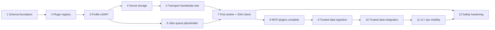
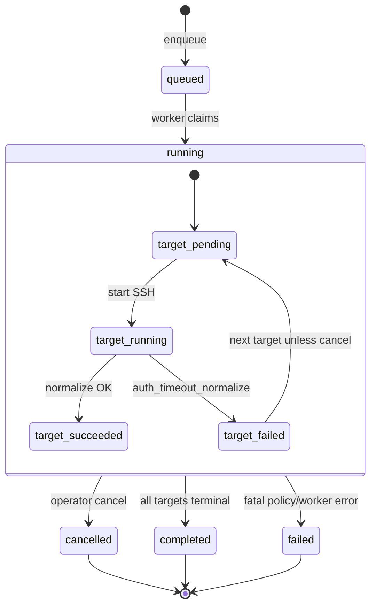

# Credentialed Checks Engine — MVP implementation plan

> **Note:** Labels like “slice” / “phase” below are **historical planning vocabulary** only. Shipped paths use neutral filenames; see [`scripts/deploy_file_manifest.php`](../scripts/deploy_file_manifest.php) for what **`deploy.sh`** / **`setup.sh`** install.

This document is a **staged implementation plan** for the MVP described in [Credentialed Checks Engine — design](CREDENTIALED_CHECKS_ENGINE.md). It breaks work into **milestones** with **validation gates**. It does not prescribe calendar sequencing beyond the dependency order captured below.

**Capability anchors**

- Additive schema and APIs only; no replacement of scan or Zabbix flows.
- **Observations first** for trusted data; **no direct `asset_assertions` writes** from the executor ([Trusted data model](TRUSTED_DATA_MODEL.md)).
- No arbitrary command execution, no auto-remediation, no plugin marketplace, no broad credential reuse without **scope binding** enforced in API.
- Secrets never in API responses, UI fields, or unstructured logs.

**Design reference:** [CREDENTIALED_CHECKS_ENGINE.md](CREDENTIALED_CHECKS_ENGINE.md)

---

## Slice dependency overview



*Note:* **Slice 4** (secrets) is required before **slice 5** (handshake tests) when using stored material. **Slice 6** (job templates + `worker_jobs` queue + placeholder worker) lands after profiles/plugins; **slice 7** adds first real SSH plugin execution.

---

## Run and target state machine (worker)



---

## Slice 1 — Schema and settings foundation (**implemented**)

### Purpose

Land **additive** SQLite tables and indexes so later slices can store profiles, plugins, jobs, runs, results, and artifacts **without any execution path**. Establish a single migration gate (`config.migration_credentialed_checks_v1`) in `api/db.php` so deploys are idempotent.

### Files likely involved

- `api/db.php` — `st_migrate_credentialed_checks_v1()`: idempotent `CREATE TABLE IF NOT EXISTS`, indexes, migration marker.
- `sql/schema.sql` — same tables for fresh installs.
- `docs/CREDENTIALED_CHECKS_ENGINE.md` — §6 physical schema (includes `target_id` on results, `credential_check_artifacts` column list, quoted `blob` column name).

### Schema / API changes

**Tables (MVP minimal):**

| Table | MVP role |
|-------|-----------|
| `credential_check_plugins` | Built-in manifests seeded from `api/lib_credentialed_checks.php` (slice 2). |
| `credential_profiles` | Transport, `principal_json`, `secret_ciphertext`, `scope_json`, audit columns, `last_test_*`. |
| `credential_check_jobs` | `target_mode`, `target_json`, `plugin_selection_json`, `policy_json`, `enabled`. |
| `credential_check_runs` | `job_id` nullable, optional `worker_job_id` (substrate link when slice 7 enqueues), `status`, `summary_json`, `initiated_by`, timestamps. |
| `credential_check_run_targets` | Per-target status, safe errors, `started_at` / `finished_at`. |
| `credential_check_results` | `run_id`, optional `target_id`, `asset_id`, `plugin_key`, `plugin_version`, `status`, `normalized_json`, `metrics_json`, `created_at`. |
| `credential_check_artifacts` | `result_id`, `kind`, `storage_path`, quoted `"blob"` BLOB column, `sha256`, `size_bytes`, `redaction_version`, `created_at` — all nullable where appropriate for slice 7+ evidence. |

**Settings (optional slice 1 or 3):**

- Global caps: `cred_check_max_concurrency`, `cred_check_default_timeout_ms`, `cred_check_max_output_bytes` in existing `config` key pattern or dedicated keys.

### Security risks

- Empty migration gives **false confidence** if tables exist but RLS/RBAC not wired yet — mitigate: slice 2 adds **admin-only** read-only plugin API; still **no execution** until worker slices; **encrypted secrets** arrive in slice 4 (`SURVEYTRACE_CRED_SECRET_KEY`).
- `secret_ciphertext` column present; **slice 3** was metadata-only; **slice 4** writes encrypted envelopes when `SURVEYTRACE_CRED_SECRET_KEY` is configured.

### Validation steps

- Fresh DB: open app, migrations run once, tables present (`sqlite3` / admin query).
- Repeat open: migration flag `migration_credentialed_checks_v1` prevents duplicate DDL errors.
- `php -l api/db.php` · `sqlite3 :memory: < sql/schema.sql` — cred tables exist.

### Rollback considerations

- Migration is additive; rollback = feature flag off + no API routes registering (slices 2+). Dropping tables is **destructive** (profiles lost); prefer `enabled=0` jobs and leaving tables empty in non-prod.

### Explicitly deferred

- WinRM tables/columns beyond `transport` enum placeholder if desired.
- External artifact store (S3); large-object streaming.

---

## Slice 2 — Built-in plugin registry (**implemented**)

### Purpose

Ship **versioned built-in plugin manifests** in `credential_check_plugins` with **idempotent seeding** and **admin-only read-only** listing. **No execution**, no credential storage/use, no worker enqueue, no observation writes. Establishes allowlisted-operations metadata for future SSH/WinRM/SNMP workers.

### Files involved

- `api/lib_credentialed_checks.php` — `st_cred_tables_ready`, `st_cred_builtin_plugin_manifests`, `st_cred_seed_builtin_plugins`, `st_cred_list_plugins`, `st_cred_get_plugin`.
- `api/credentialed_checks.php` — `GET` admin-only JSON (`plugins=1` list; `plugin_key` / optional `version` for one row).
- `api/db.php` — calls `st_cred_seed_builtin_plugins` after cred schema migration when tables are ready.

### Built-in plugins (seeded)

| plugin_key | version | transport | state | Notes |
|------------|---------|-----------|-------|--------|
| `ssh.linux.os_release` | 1.0.0 | ssh | **stable** | Fixed `/etc/os-release` read; caps/timeouts in manifest. |
| `ssh.linux.package_inventory` | 1.0.0 | ssh | **experimental** | Fixed dpkg/rpm templates; large-output truncation policy documented in manifest. |
| `snmpv3.device_identity` | 1.0.0 | snmpv3 | **experimental** | OID allowlist for sysDescr / sysObjectID / sysName only; read-only GET. |

### Safety model

- Manifests declare **allowlisted_operations** only — executor slices must map `plugin_key` to these templates (no arbitrary argv).
- **Secrets** never appear in manifests, API responses, or this slice’s code paths.
- Unknown rows in `credential_check_plugins` are **never deleted** by the seeder; only matching `(plugin_key, version)` built-ins are upserted.

### Validation steps

- `php -l api/lib_credentialed_checks.php` · `php -l api/credentialed_checks.php`
- After `st_db()`, three built-in rows exist; second bootstrap leaves count unchanged (upsert idempotent).
- `GET /api/credentialed_checks.php?plugins=1` as admin returns metadata only.

### Explicitly deferred

- Job UI dropdown, experimental visibility toggles, rejecting unknown `plugin_key@version` on job save → **Slice 6** extensions and later profile/job slices.

---

## Slice 3 — Credential profile UI/API (**implemented** — metadata + slice 4 secrets)

### Purpose

Operators manage **credential profile metadata** (name, transport, `principal_json`, `scope_json`, enabled) under **admin-only** API + Settings UI. **Slice 3 originally shipped metadata-only**; **slice 4** adds optional **encrypted** `secret_ciphertext` via `set_secret` / `clear_secret` when `SURVEYTRACE_CRED_SECRET_KEY` is set. **No transport test, no plugin runs.** List/get responses **never** include `secret_ciphertext`; responses expose `has_secret` / `secret_status` and a redacted `secret_envelope` summary when a secret exists.

### Files involved

- `api/credential_profiles.php` — `GET` list / `GET?id=` (+ `encryption` status); `POST` JSON actions `create`, `update`, `set_enabled`, `delete`, `set_secret`, `clear_secret` (CSRF on POST).
- `api/lib_credential_profiles.php` — table check, JSON encode/validate, public row shaping, job reference counting, summaries, secret material normalization (with `api/lib_secrets.php`).
- `api/db.php` — `st_migrate_cred_profiles_deleted_at_v1()` adds `deleted_at` + index for soft-archive when a profile is still referenced by `credential_check_jobs`.
- `public/index.php` — Settings → **Credentialed checks — profiles** card (admin only): table, modal add/edit, enable/disable, remove (hard delete if unused; **archive** if jobs reference the profile). **Handshake test** UI (slice 5) in the modal + card hint.

### Schema / API changes

- `credential_profiles.deleted_at` (nullable) — archived rows hidden from list; `delete` action archives when `credential_check_jobs` references the profile.
- Audit via existing `user_audit_log`: `credential_profile.created`, `.updated`, `.enabled`, `.disabled`, `.deleted`, `.archived`, and slice 4 `.secret_*` events (details contain ids/names/transport — **no secrets**).

### Security risks

- Use POST JSON only for mutations (no secrets in query string). Slice 4 encrypts payloads server-side; responses never echo ciphertext or plaintext.

### Validation steps

- `php -l api/credential_profiles.php api/lib_credential_profiles.php api/lib_secrets.php api/db.php`
- Admin: create/edit/list/disable/delete; non-admin: **403**.
- `GET` / `POST` responses contain **no** `secret_ciphertext` key (envelope summary only when stored).

### Rollback considerations

- Leave tables in place; stop shipping `credential_profiles.php` / hide UI card if needed.

### Explicitly deferred

- Vault/HSM; automatic key rotation (documented as operator-managed in slice 4).

---

## Slice 4 — Credential secret storage foundation (**implemented**)

### Purpose

Provide **authenticated encryption** for profile secrets in `credential_profiles.secret_ciphertext` using an **application key from the environment** (`SURVEYTRACE_CRED_SECRET_KEY`). **No** SSH/SNMP/WinRM test, **no** check execution, **no** worker enqueue. API returns **`has_secret`**, **`secret_status`**, and a **non-decrypting** `secret_envelope` summary only — never `secret_ciphertext` or plaintext.

### Files involved

- `api/lib_secrets.php` — `st_secret_encrypt`, `st_secret_decrypt`, `st_secret_available`, `st_secret_status`, `st_secret_redact_summary` (libsodium secretbox preferred; OpenSSL AES-256-GCM fallback).
- `api/lib_cred_secret_helper.php` — **`sudo`**-bounded **`daemon/cred_secret_ops_cli.php`** for **`set_secret`**, **`clear_secret`**, and **`encryption`** status when the hardened model is used.
- `daemon/cred_secret_ops_cli.php` — CLI entry: allowlisted env from **`surveytrace.env`**, stdin JSON actions (**`status`**, **`encrypt_for_profile`**, **`transport_test_for_profile`**).
- `api/lib_credential_profiles.php` — transport-specific `st_cred_profile_normalize_secret_material`; list/get selects ciphertext only server-side for envelope summary (never exposed in JSON).
- `api/credential_profiles.php` — `GET` includes `encryption` status; `POST` actions `set_secret`, `clear_secret`.
- `public/index.php` — modal: set/replace / clear secret, disabled when encryption unavailable.
- `public/css/app.css` — `.modal-w640` for credential modal width.

### Encryption / operations

- **Key:** `SURVEYTRACE_CRED_SECRET_KEY` only (trimmed). Accepts base64 of 32 raw bytes, 64-char hex (32 bytes), or arbitrary string (SHA-256 → 32-byte key). Prefer `openssl rand -base64 32` for production. In production hardening, the key is stored in **`/etc/surveytrace/surveytrace.env`** (readable by **`surveytrace`**, not **`www-data`**); **`setup.sh` / `deploy.sh`** configure **`sudoers`** so **`www-data`** may invoke **`daemon/cred_secret_ops_cli.php`** as **`surveytrace`** with a **single fixed** PHP CLI path (**`SURVEYTRACE_PHP_CLI_BIN`** must match sudoers).
- **PHP-FPM / Apache:** **`SURVEYTRACE_CRED_SECRET_KEY` does not need to appear in the FPM pool or Apache environment** for normal **`set_secret`**, **`clear_secret`**, handshake **`action=test`**, or **`encryption.available`** — those paths use **`api/lib_cred_secret_helper.php`** → **`sudo`** → **`cred_secret_ops_cli.php`**, with JSON on **stdin** (no secrets on argv). The helper applies an **allowlisted** subset of **`SURVEYTRACE_*`** from the env file and returns **safe status / envelopes / test results**, not plaintext secrets.
- **Strict key mode:** set `SURVEYTRACE_CRED_SECRET_KEY_STRICT=1` to reject weak ad-hoc passphrase formats and require strong key formats.
- **Missing key:** metadata CRUD unchanged; `set_secret` returns **503** with message `Credential encryption is not configured.`
- **Key change:** existing envelopes become undecryptable; operators must re-enter secrets (rotation / dual-key not in this slice).
- **Backup/restore:** DB backup contains ciphertext; **restore on a host without the same key loses secrets** (plaintext not recoverable).
- **Multi-node parity:** all decrypting nodes (**surveytrace** user + worker + helper) must use the **same** key value; **`php-fpm`** does not need the key in its env when the helper model is in use.

### API (POST)

- `set_secret`: `{ "action":"set_secret", "id": N, "secret_material": { ... } }` — allowed keys only: **SSH:** `password` *or* `private_key`, optional `passphrase` with key; **SNMPv3:** `auth_password` and/or `priv_password`; **WinRM:** `password`. Unknown keys rejected.
- `clear_secret`: `{ "action":"clear_secret", "id": N }`.

### Audit (`user_audit_log`)

- `credential_profile.secret_set`, `.secret_replaced`, `.secret_cleared`, `.secret_set_failed` (no secret values in `details_json`).

### Validation steps

- `php -l api/lib_secrets.php api/lib_credential_profiles.php api/credential_profiles.php`
- Without env key: `set_secret` fails safely; `GET` list still works.
- With key: `set_secret` succeeds; `GET` never contains `secret_ciphertext`; audit rows contain no secret material.

### Explicitly deferred

- Using decrypted secrets for **plugin/worker execution** (later slices). **Transport handshake tests** (slice 5) decrypt only for the subprocess boundary.
- Re-encrypt-on-key-rotate / dual-key envelope versioning beyond storing `v` in JSON.

---

## Slice 5 — Transport handshake test (**implemented** — SSH + SNMPv3)

### Purpose

**Handshake-only** validation of credential profiles: **no plugins**, **no worker_jobs**, **no observations/findings**. Admin-only `POST` `action=test` with explicit **target_host** (not persisted) + optional **port**. The **credential secret helper** (**`cred_secret_ops_cli.php`** as **`surveytrace`**) decrypts the stored envelope inside the privileged boundary, runs the **Python transport** subprocess with **stdin JSON**, and returns **safe test metadata** to **`php-fpm`** for **`last_test_*`** updates — **`PHP-FPM` does not need the master key in its environment** when sudoers + helper are configured.

### Files involved

- `api/credential_profiles.php` — `action=test` (CSRF); body: `id`, `target_host`, optional `port`, optional `timeout_sec` (clamped).
- `api/lib_cred_secret_helper.php` — **`sudo`**-bounded calls to **`daemon/cred_secret_ops_cli.php`** with **`action=transport_test_for_profile`** (stdin JSON; no in-pool decrypt when helper is available).
- `api/lib_credential_profile_transport_test.php` — target validation, flock single-flight lock under `data/cred_profile_transport_test.lock`, helper invocation + safe response shaping, DB + audit orchestration.
- `daemon/cred_transport_cli.py` — stdin JSON → stdout JSON (one line).
- `daemon/cred_transport_ssh.py` — **paramiko**: connect, `exec_command('true')`, optional `uname -s` hint (bounded).
- `daemon/cred_transport_snmp.py` — **pysnmp**: single GET **sysDescr.0** only.
- `api/db.php` — migration `migration_cred_profile_test_columns_v1`: `last_test_error_code`, `last_test_duration_ms`.
- `public/index.php` — modal “Run handshake test”; table shows last code/duration.

### SSH host key policy

- Default: **AutoAddPolicy** for the handshake subprocess (operator-supplied target); the API sets **`SURVEYTRACE_CRED_TRANSPORT_HANDSHAKE=1`** so pool **`SURVEYTRACE_CRED_SSH_TEST_HOST_KEY_POLICY=reject`** does not apply to this path. **Production** cred SSH uses **`SURVEYTRACE_CRED_SSH_CHECK_HOST_KEY_POLICY`** when set (e.g. **`accept_new`** for many hosts), else legacy **`SURVEYTRACE_CRED_SSH_TEST_HOST_KEY_POLICY`** (`cred_check_ssh_os_release.py`). Documented in [deployment wiki](wiki/deployment.md).

### SNMPv3 limitations

- Principal must include **`securityName`** (or `security_name`). Optional **`authProtocol`** / **`privProtocol`** in principal (`SHA`|`MD5`, `AES`|`DES`). **Privacy without auth password** is rejected at the API. Only **sysDescr.0** is read; no walk/SET.

### Audit (`user_audit_log`)

- `credential_profile.test_started`, `.test_succeeded`, `.test_failed` — details include `credential_profile_id`, `transport`, `target_host`, `code`, `duration_ms` — **never secrets or stderr**.

### Safe error codes (subset)

`ok`, `auth_failed`, `timeout`, `network_unreachable`, `host_key_mismatch`, `protocol_error`, `unsupported_transport`, `encryption_unavailable`, `decrypt_failed`, `invalid_profile`, `busy`.

### Validation steps

- `php -l api/lib_credential_profile_transport_test.php api/credential_profiles.php api/db.php`
- `python3 -m py_compile daemon/cred_transport_cli.py daemon/cred_transport_ssh.py daemon/cred_transport_snmp.py`
- `pip install paramiko pysnmp` in venv (`setup.sh` installs both).
- Without secret: test returns **invalid_profile**; without encryption key: **encryption_unavailable**.

### Explicitly deferred

- **WinRM** handshake. **Scope-bound target resolution** (asset picker / `scope_json` enforcement). **Known-hosts persistence** / TOFU UX. **Parallel or queued** tests beyond single global flock.

---

## Slice 6 — Job templates and execution queueing (**implemented**)

### Purpose

Deliver the **operator workflow** and **worker substrate wiring** for credentialed checks. **Slice 6** landed queueing, cancel, and (optionally) **placeholder-only** worker behavior via **`SURVEYTRACE_CRED_CHECK_PLACEHOLDER_ONLY`**. **Slice 7** adds real **`ssh.linux.os_release`** execution in **`credential_check_worker.py`** (see slice 7).

- **Job templates** (`credential_check_jobs`): profile, plugin selection, target mode (`assets` explicit IDs or `scope` → assets with `scope_id`), policy (`max_concurrency`, `timeout_ms`), `enabled`.
- **Runs** (`credential_check_runs` + `credential_check_run_targets`): snapshot targets at **launch**; enqueue **`worker_jobs`** (`job_type = credentialed_check`, `entity_type = credential_check_run`, `entity_id = run id`).
- **Worker** (`daemon/credential_check_worker.py` + helpers): processes targets per job selection; plugins other than **`ssh.linux.os_release@1.0.0`** remain **`skipped` / `not_implemented`** until later slices.

Also includes **strict validation** on save/launch (profile transport vs plugin transport, unknown plugins rejected, **experimental** plugins require `accept_experimental` on launch), **admin-only** HTTP APIs, **audit** events, **cancel** (run + cooperative worker cancel + queued/leased terminal cancel helpers), and a **System Health** line under the worker band.

### Stabilization (slice 6–7 queueing + worker)

- **Run ↔ worker row:** the worker syncs `credential_check_runs` to terminal `cancelled` / `failed` when the linked `worker_jobs` row is cancelled or fails validation, including cancel-before-lease, invalid payload after lease, and a top-level exception handler so a single bad job does not kill the daemon loop.
- **Idempotency:** each **Run now** creates a new run and one `worker_jobs` row; duplicate `worker_jobs` for the same run are not created by launch. `--once` with an empty queue exits cleanly.

### Files involved

- `api/lib_credential_check_ops.php` — validation, resolve targets, CRUD jobs, launch/cancel/list/detail runs, health snapshot.
- `api/credential_check_jobs.php`, `api/credential_check_runs.php` — HTTP entrypoints.
- `api/lib_worker_jobs.php` — `st_worker_finalize_queued_cancel`, `st_worker_finalize_leased_cancel`, `st_worker_finish_job_cancelled` (cancel UX for queued/leased rows).
- `daemon/credential_check_worker.py`, `daemon/cred_check_run.py`, `daemon/cred_check_ssh_os_release.py`, `daemon/cred_check_ssh_packages.py`, `daemon/cred_check_snmp_identity.py`, `daemon/cred_secret_decrypt.py`, `daemon/cred_decrypt_cli.php`, `daemon/worker_jobs.py` — execution + cancel completion.
- `public/index.php` — Settings: jobs table, run history, modals, Run now / cancel / detail.
- `api/health.php` — `credential_check_runs` snapshot.
- `surveytrace-credential-check-worker.service` — optional systemd unit (same layout as collector ingest).
- `deploy.sh`, `setup.sh` — ship + `py_compile` the new daemon.

### Schema / API changes

- **No new tables** (uses slice 1 tables). `credential_check_runs.status` app values include `resolving_targets`, `ready` (reserved), `queued`, `running`, `completed`, `failed`, `cancelled` (see `sql/schema.sql` comments).

### Security risks

- Jobs reference **profile ids** only (no secrets in job rows). Launch still **admin-only**. Experimental plugins require explicit operator confirmation in API/UI.

### Validation steps

- `php -l` on touched PHP; `python3 -m py_compile` on touched Python; `bash -n` on touched shell scripts.
- **Automated fixture (no production DB, not deployed):** from repo root run `./scripts/smoke_credential_checks_placeholder.sh` — creates a temp SQLite DB from `sql/schema.sql`, seeds a profile/job/asset, calls `st_cc_job_create` + `st_cc_run_launch()`, runs `daemon/credential_check_worker.py --once` with `SURVEYTRACE_DB_PATH`, asserts completed run + target + worker job; then launches a **second** run, calls `st_cc_run_cancel()` before the worker leases it (cancel-before-lease), asserts cancelled run/worker/target, runs the worker `--once` again (idle / terminal-only DB), and checks the first run stays `completed`. Does **not** exercise HTTP APIs or UI.
- Create/edit/delete job; Run now creates `worker_jobs` + run targets; cancel path updates run + worker row.
- **`./scripts/smoke_credential_checks_placeholder.sh`** sets **`SURVEYTRACE_CRED_CHECK_PLACEHOLDER_ONLY=1`** for the worker: no SSH, no `credential_check_results` / observations (slice-6-style assertions). Remove that env for real **`ssh.linux.os_release`** execution against a test host.

### Rollback considerations

- Stop `credential_check_worker` service; runs may stay `queued` until cancelled or worker resumed.

### Explicitly deferred (post slice 8)

- SNMP plugin execution, WinRM, schedules/recurrence.

---

## Slice 7 — First SSH execution (`ssh.linux.os_release`) (**implemented**)

### Purpose

**One bounded SSH path** for **`ssh.linux.os_release@1.0.0`**: decrypt profile secret (PHP-compatible envelope via **`daemon/cred_decrypt_cli.php`**), connect with **Paramiko** (same host-key policy env as handshake tests), read **`/etc/os-release`** via **SFTP** or fixed **`cat /etc/os-release`**, enforce **timeout** and **stdout/stderr caps**, write **`credential_check_results`**, small **stdout artifact**, and **`os_version_observed`** observation (`recon_sources.source_type = credentialed_check`). **No arbitrary commands**; other plugins stay **`not_implemented`**.

### Files involved

- `daemon/credential_check_worker.py`, `daemon/cred_check_run.py`, `daemon/cred_check_ssh_os_release.py`, `daemon/cred_secret_decrypt.py`, `daemon/cred_decrypt_cli.php`
- `api/lib_credential_check_ops.php` — launch payload/summary; run detail `results` / `result_counts`; health snapshot **`completed_recent_24h`**
- `api/lib_reconciliation.php` — **`st_recon_seed_sources`**: `credentialed_check` recon source
- `daemon/recon_observations.py` — `normalize_os_text_public`, `upsert_credentialed_check_os_observation`
- `public/index.php` — Settings help + run detail modal + health line
- `deploy.sh`, `setup.sh` — ship new daemon files + `py_compile` / `php -l`

### Security risks

- **Command injection** — mitigated: **asset IP only**, fixed remote path / fixed exec string, **no PTY**, no operator argv on remote shell.
- **Decrypt on worker** — requires **`php`** + **`SURVEYTRACE_CRED_SECRET_KEY`** aligned with the app; envelope **`credential_profile_id`** context must match encryption.

### Validation steps

- `php -l` / `python3 -m py_compile` on touched paths; **`./scripts/smoke_credential_checks_placeholder.sh`** (placeholder-only worker); **`python3 daemon/cred_check_os_release_selftest.py`**.
- Manual: wrong password → `auth_failed`; tiny **`timeout_ms`** → `timeout`; disabled profile/job → safe skip/fail; output cap → `output_too_large`; repeat run → observation upsert idempotent.

### Rollback considerations

- Stop **`surveytrace-credential-check-worker`**; optional env **`SURVEYTRACE_CRED_CHECK_PLACEHOLDER_ONLY=1`** forces no remote I/O.

### Explicitly deferred

- Multi-plugin parallel per target, distributed queue (Redis), WinRM transport — **`os_version_observed`** lazy resolver integration is **slice 10 (done)**; remaining transport/plugins still future work.

---

## Slice 8 — SSH `package_inventory` (**implemented**)

### Purpose

**Second bounded SSH path** for **`ssh.linux.package_inventory@1.0.0`**: same decrypt + Paramiko session as slice 7, then **fixed** **`dpkg-query`** and **`rpm -qa`** strings only (detect manager by trying dpkg first, then rpm). **`get_pty=False`**, strict timeout, stdout/stderr caps; stdout **truncates** at cap with **`partial`/`truncated`** rather than dropping the whole result. **`normalized_json`** holds bounded **`packages[]`** (row cap + field length caps + control-char strip); run-detail API exposes a **preview** with **`packages_sample`** only (not the full list). **One** summarized **`package_inventory_observed`** per result — **no** mass **`package_installed`** rows. **`software_observed` (software reconciliation slice 1):** additionally **≤128** deduped per-package identity observations per asset (**latest inventory replaces** prior rows for this plugin); **no** CVE/assertions/reconciliation consumption yet. **No CVE matching, no findings, no assertions** from the executor.

### Files involved

- `daemon/cred_check_ssh_packages.py`, `daemon/cred_check_run.py`, `daemon/cred_check_ssh_os_release.py` (shared `read_exec_stdout_bounded` with truncate mode), `daemon/recon_observations.py` (`upsert_cred_package_inventory_summary_observation`, **`upsert_cred_software_observations`**)
- `api/lib_credential_check_ops.php` — `st_cc_normalized_preview_public`, extended metrics allowlist
- `daemon/cred_check_package_inventory_selftest.py` — no-network parser tests
- `daemon/st_software_observation_selftest.py` — **`software_observed`** normalization / dedupe / cap / replace
- `deploy.sh`, `setup.sh` — ship + `py_compile`

### Validation steps

- `python3 daemon/cred_check_package_inventory_selftest.py`; `python3 daemon/st_software_observation_selftest.py`; `php scripts/st_software_inventory_summary_selftest.php` (slice 2 summary resolver); `php scripts/st_software_inventory_evidence_selftest.php` (slice 3 UX/API bounds); `php scripts/st_software_inventory_diagnostics_selftest.php` (slice 4 bands + health contracts); slice 7 selftest unchanged; placeholder smoke; `php -l` / `py_compile` on touched files.
- Manual: Debian/Ubuntu → `package_manager=dpkg`; RHEL-style → `rpm`; mixed job with **`os_release`** + **`package_inventory`** → per-plugin status isolation.

### Explicitly deferred

- WinRM, per-package **`package_installed`** observations at scale, CVE / software reconciliation, findings.
- **Future investigation (roadmap):** [Package-advisory correlation](../ROADMAP.md#package-advisory-correlation-future) — how bounded inventory could support advisory correlation under explicit non-authority and no-finding-from-names-alone constraints; remediation remains deferred.

---

## Slice 9 — SNMPv3 `device_identity` (**implemented**)

### Purpose

**SNMPv3-only** execution for **`snmpv3.device_identity@1.0.0`** when the job’s credential profile transport is **`snmpv3`**: fixed triple GET (**sysDescr.0**, **sysObjectID.0**, **sysName.0**) via **`daemon/cred_check_snmp_identity.py`** (**pysnmp**). No walk, no SET, no operator OIDs. Profiles whose transport does not match selected plugins insert **`unsupported_transport`** per mismatched plugin; SSH plugins still run on **SSH** profiles independently.

Summarized observations only: **`hostname_observed`** / **`fqdn_observed`** from **sysName** when present (existing reconciliation paths apply lazily); **`device_identity_observed`** digest summary — **no** per-OID observation explosion. **No assertions**, device merges, or SNMP fusion.

### Files involved

- `daemon/cred_check_snmp_identity.py`, `daemon/cred_check_run.py`, `daemon/recon_observations.py` (`upsert_cred_snmp_sysname_observations`, `upsert_cred_device_identity_summary_observation`)
- `api/lib_credential_check_ops.php` — SNMP **`normalized_preview`**, **`oids_present`** in metrics allowlist
- `daemon/cred_check_snmp_identity_selftest.py`
- `deploy.sh`, `setup.sh`

### Validation

- `python3 daemon/cred_check_snmp_identity_selftest.py`; existing slice 7/8 selftests + placeholder smoke; **`pysnmp`** in app venv (same as handshake **`cred_transport_snmp.py`**).

### Explicitly deferred

- SNMP walks, SNMP SET, arbitrary OID maps, CVE/device fusion.

---

## Slice 10 — Trusted data integration *(implemented)*

### Purpose

Extend **`os_platform`** / identity reconciliation to weight **`os_version_observed`** (slice 7) and SNMP-derived **`hostname_observed`** / **`device_identity_observed`** (slice 9) alongside scan/Zabbix observations — via **existing lazy reconciliation**, never executor-direct **`asset_assertions`** writes.

### Files touched

- `api/lib_reconciliation.php` — cred OS merge + 90d staleness; SNMP hostname scoring; evidence **`contribution_hint`**; health **`credentialed_observation_count`** / stale cred OS count.
- `public/index.php` — host evidence tables (compact **To belief** / plugin ref columns on observations + assertion sources).
- `api/health.php` — richer **`trusted_data`** error fallback keys.
- `docs/TRUSTED_DATA_MODEL.md`, `docs/CREDENTIALED_CHECKS_ENGINE.md` — confidence / deferral notes.
- `scripts/st_recon_trusted_data_selftest.php` — no-network reconciliation assertions.

### Schema / API changes

- None required (additive observation types already exist). API payloads gain optional observation fields (`contribution_hint`) and extended assertion-source columns (`observation_source_ref`, `observation_observed_at`).

### Security risks

- Observation cadence tied to **run history** — retention pruning remains operational.

### Validation steps

- `php scripts/st_recon_trusted_data_selftest.php`; existing slice 7/8/9 selftests + placeholder smoke; open host detail and confirm cred-sourced rows show source + ref + **To belief** hints.

### Rollback considerations

- Disable ingest flag: runs complete but `ingest_status=skipped` on result row (optional column) or separate ingest queue table.

### Explicitly deferred

- New assertion family `software_inventory`; CVE correlation from packages; findings from missing patches.

---

## Slice 11 — UI and operational visibility (**implemented**)

### Purpose

Polish operator workflows **without** new execution types: compact **Credentialed checks** host overview (`credential_check_host_summary`), richer **Settings → runs** (filters, badges, duration, targets, partial/error hints), structured **run detail** (grouped sections, bounded previews, admin worker debug via `debug=1`), **health** hints (24h stats, stale runs, bad-profile jobs, approx store when anomalous), **evidence source tier** chips, and **retention** copy (bounded data; no auto-prune in this release).

### Files touched

- `public/index.php`, `public/css/app.css` — host block, runs filters/table/modal, health rendering, `stEvidenceSourceTierHtml`.
- `api/lib_credential_check_ops.php`, `api/credential_check_runs.php`, `api/assets.php`, `api/lib_reconciliation.php`, `api/health.php` — list filters/detail/health snapshot/summary APIs (as landed in slice 11).
- `docs/CREDENTIALED_CHECKS_ENGINE.md`, `docs/wiki/troubleshooting.md`, `docs/RELEASE_READINESS_CHECKLIST.md`.

### Schema / API changes

- None beyond existing cred + worker tables; list/detail query shapes extended in PHP.

### Security risks

- Run detail never returns raw artifact blobs; `debug=1` is admin-only and exposes `worker_jobs` metadata only (no secrets).

### Validation steps

- `php -l` on touched PHP; `python3 -m py_compile` on touched Python if any; slice 7/8/9 selftests + slice10 recon selftest + placeholder smoke; manual UI: empty runs, failed run, partial package run, SNMP identity, host with scan + cred evidence, light/dark, narrow width.

### Explicitly deferred

- Reports CSV extensions; automatic pruning/TTL jobs; signed artifact URLs.

---

## Slice 12 — Safety and audit hardening

### Purpose

Close the loop on **cancellation**, **concurrency**, **rate limits**, **output redaction** (IPs/password-like strings in stdout), **secret redaction** in errors, and **structured failure states** surfaced to UI and audit.

### Files likely involved

- `api/lib_cred_check_policy.php` (new) — concurrency acquire (SQLite advisory lock or lease table).
- `api/lib_cred_check_redact.php` (new) — regex-based scrub for artifacts.
- Worker loop — cooperative cancel checks between targets.
- Reuse patterns from `api/lib_rate_limit.php` if applicable.

### Schema / API changes

- Optional `credential_check_runs.cancel_requested_at`, `cancelled_by`.

### Security risks

- Advisory locks wrong → double execution — validate under parallel PHP-FPM workers with load test (light).

### Validation steps

- Cancel: no new targets start; in-flight completes or marks cancelled within timeout window.
- Concurrency: second run waits or gets `429`/`409` per product choice.
- Redaction unit tests (strings with fake passwords).

### Rollback considerations

- Policy env vars revert to defaults; worker respects lower caps.

### Explicitly deferred

- Per-subnet throttle, OS-level sandbox (firejail), dedicated worker user.

---

## Recommended first plugin manifest examples

These are **illustrative JSON** fragments for `credential_check_plugins.manifest_json` (exact shape can match internal schema validator in slice 6+ job/executor slices).

### `ssh.linux.os_release` (stable)

```json
{
  "plugin_key": "ssh.linux.os_release",
  "version": "1.0.0",
  "transport": "ssh",
  "title": "Linux OS release (os-release)",
  "state": "stable",
  "privilege": "none",
  "timeout_ms_default": 15000,
  "timeout_ms_max": 60000,
  "allowlisted_operations": [
    {
      "kind": "exec",
      "argv_template": ["/bin/cat", "/etc/os-release"],
      "readonly_paths": ["/etc/os-release"]
    }
  ],
  "output_schema_version": 1,
  "output_schema": {
    "type": "object",
    "required": ["os_release_parsed"],
    "properties": {
      "os_release_parsed": { "type": "object" },
      "raw_redacted_sha256": { "type": "string" }
    }
  },
  "remediation": null
}
```

### `ssh.linux.package_inventory` (stable)

```json
{
  "plugin_key": "ssh.linux.package_inventory",
  "version": "1.0.0",
  "transport": "ssh",
  "title": "Linux package inventory (dpkg or rpm)",
  "state": "stable",
  "privilege": "none",
  "timeout_ms_default": 60000,
  "timeout_ms_max": 120000,
  "allowlisted_operations": [
    {
      "kind": "exec_detect",
      "detectors": [
        {
          "if_path_exists": "/usr/bin/dpkg-query",
          "argv_template": ["/usr/bin/dpkg-query", "-W", "-f=${Package}\\t${Version}\\n"]
        },
        {
          "if_path_exists": "/bin/rpm",
          "argv_template": ["/bin/rpm", "-qa", "--qf", "%{NAME}\\t%{VERSION}-%{RELEASE}\\n"]
        }
      ]
    }
  ],
  "output_schema_version": 1,
  "output_schema": {
    "type": "object",
    "required": ["package_manager", "packages"],
    "properties": {
      "package_manager": { "type": "string", "enum": ["dpkg", "rpm", "none"] },
      "packages": {
        "type": "array",
        "maxItems": 20000,
        "items": {
          "type": "object",
          "required": ["name", "version"],
          "properties": {
            "name": { "type": "string" },
            "version": { "type": "string" }
          }
        }
      }
    }
  },
  "remediation": null
}
```

*Implementation note:* `exec_detect` is a **product-internal** manifest feature, not arbitrary user logic — the worker maps it to fixed code paths only.

### `snmpv3.device_identity` (experimental until proven)

```json
{
  "plugin_key": "snmpv3.device_identity",
  "version": "1.0.0",
  "transport": "snmpv3",
  "title": "SNMPv3 device identity (sys*)",
  "state": "experimental",
  "privilege": "none",
  "timeout_ms_default": 10000,
  "timeout_ms_max": 30000,
  "allowlisted_operations": [
    { "kind": "snmp_get", "oids": ["1.3.6.1.2.1.1.1.0", "1.3.6.1.2.1.1.2.0", "1.3.6.1.2.1.1.5.0"] }
  ],
  "output_schema_version": 1,
  "output_schema": {
    "type": "object",
    "required": ["sys_descr", "sys_object_id", "sys_name"],
    "properties": {
      "sys_descr": { "type": "string" },
      "sys_object_id": { "type": "string" },
      "sys_name": { "type": "string" }
    }
  },
  "remediation": null
}
```

---

## Table lifecycle (data retention, MVP)

| Entity | MVP retention |
|--------|----------------|
| Profiles | Until operator delete (soft-delete optional). |
| Jobs | Keep disabled jobs for audit. |
| Runs / targets / results | Bounded retention **open decision** (e.g. 90 days) — implement as later slice or cron purge with audit. |
| Artifacts | Smallest viable: truncate + store hash; delete with result row. |

---

## Open decisions before coding

1. **SSH implementation:** `phpseclib` (pure PHP) vs small **CLI** `ssh` wrapper vs ext-ssh2 — tradeoffs for host key pinning and deployability.
2. **Worker invocation:** in-process async not realistic in PHP; choose **CLI cron** (`php api/cred_check_worker.php`) vs queue table polled every minute.
3. **Host key policy default:** `reject_unknown` vs operator-guided pin on first success.
4. **Package plugin shape:** single `ssh.linux.package_inventory` vs split dpkg/rpm plugins for simpler manifests.
5. **Observation type strings:** final enum set and whether to reuse existing Zabbix/scan observation types vs `_cred_check` suffix for traceability.
6. **Host detail payload:** widen `assets.php` GET vs dedicated `credential_check_summary.php?asset_id=`.
7. **Artifact storage:** DB blob vs `data_dir/cred_artifacts/…` with path in table.
8. **SNMP in first release:** ship slice 8 optional or defer to capability slice 8b after SSH stable.

---

## Suggested first smoke test scenario

1. **Environment:** One Linux VM or container on lab network; SSH key pair A; asset row with correct IP; no production data.
2. **Slice 3–5:** Create `credential_profiles` entry `transport=ssh`, scope bound to that asset only; **Test** → expect `ok` and pinned host key (if policy stores pin).
3. **Slice 7–8:** Create job with plugins `ssh.linux.os_release@1.0.0` and `ssh.linux.package_inventory@1.0.0`; **Run**; expect `completed`, per-target `succeeded`.
4. **Slice 9:** SNMP **`snmpv3`** profile + **`snmpv3.device_identity@1.0.0`** job on a reachable SNMP agent; expect **`credential_check_results`** with **sysName/sysDescr/sysObjectID** previews (bounded).
5. **Slice 10:** Open host detail; confirm **`os_version_observed`** / SNMP **`hostname_observed`** / **`device_identity_observed`** evidence with source **`credentialed_check`** where applicable; assertions change **only** via lazy reconciliation; optional **`php scripts/st_recon_trusted_data_selftest.php`** in CI.
6. **Slice 12:** Start a second run, click **Cancel** mid-flight; verify run `cancelled` or partial with no partial secrets in `credential_check_artifacts` / logs.
7. **Negative:** Wrong key → `auth_failed`, ciphertext unchanged, audit `credential.test` failure.

---

## Validation gates summary

| Gate | Criteria |
|------|-----------|
| **G1** | Schema exists; app boots; no routes execute checks. |
| **G2** | CRUD + audit; secret never in JSON responses. |
| **G3** | SSH test only; safe error classes; scope enforced. |
| **G4** | Plugins listed; disabled hidden; job validates pin. |
| **G5** | One SSH plugin runs; argv matches allowlist; caps enforced. |
| **G6** | Packages + optional SNMP; skip non-Linux cleanly. |
| **G7** | Observations written; assertions unchanged without recon. |
| **G8** | UI end-to-end; health block quiet on success path. |
| **G9** | Cancel + limits + redaction verified. |

---

## References

- [Credentialed Checks Engine — design](CREDENTIALED_CHECKS_ENGINE.md)
- [Trusted data model](TRUSTED_DATA_MODEL.md)
- [Roadmap — Credentialed checks engine](../ROADMAP.md#credentialed-checks-engine) (capability list only)
