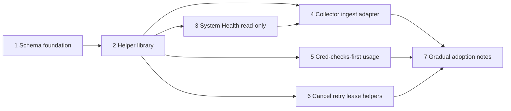

# Worker execution substrate — MVP implementation plan

Staged **implementation plan** for the design in [Worker / job execution substrate](WORKER_EXECUTION_SUBSTRATE.md). Slices 1–2 are implemented in-tree; later slices are planned work.

**Constraints (non-negotiable for early slices)**

- **Additive only**; SQLite; **no** Redis/RabbitMQ; **no** Kubernetes assumptions.
- **systemd** remains supervisor; **do not** rewrite `scan_jobs` or replace collector ingest semantics in slices 1–4.
- Preserve existing **UI/API** behavior; substrate is **parallel** until adapters opt in.

**Related:** [Credentialed Checks MVP plan](CREDENTIALED_CHECKS_MVP_PLAN.md) (worker invocation) · [Release readiness checklist](RELEASE_READINESS_CHECKLIST.md)

---

## Slice dependency overview



*Slices 4 and 5 can proceed in parallel after slice 2; slice 3 (health read-only) is implemented and depends on schema + helpers.*

---

## State transition examples (reference)

**Happy path (job)**

```text
queued → leased → running → completed
```

**Retry path**

```text
running → (fail: timeout, retryable) → retrying → queued → leased → …
```

**Cancel path**

```text
running + cancel_requested → running (cooperative checkpoints) → cancelled
```

**Stale lease recovery (sweeper)**

```text
leased | running, lease_expires_at < now → (policy) queued OR failed
```

**Worker node**

```text
starting → healthy → (missed heartbeats) → stale → (systemd restart) → starting
```

---

## Error-code examples (structured)

| `error_code` | Retryable? | Example `error_message_safe` |
|--------------|------------|------------------------------|
| `timeout` | yes | `ingest:apply exceeded 120s` |
| `storage_error` | yes | `sqlite busy` |
| `auth_error` | no | `collector token rejected` |
| `validation_error` | no | `payload schema mismatch` |
| `policy_blocked` | maybe | `concurrency cap` (product: retry or no) |
| `transport_error` | yes | `connection reset` |
| `dependency_missing` | no | `required table missing` |
| `internal_error` | no | `unexpected: see event id 48291` |

---

## System Health — how substrate state should appear (slice 3+)

Read-only block, e.g. `worker_substrate` (names illustrative):

| Field | Operator meaning |
|-------|------------------|
| `tables_ready` | Migrations applied; false → single hint line, no errors. |
| `queued_depth` | Count of `worker_jobs` in `queued` (+ optional `retrying`). |
| `oldest_queued_at` | Oldest `created_at` among queued — SLA signal. |
| `retrying_count` | Jobs in `retrying`. |
| `failed_24h` | Terminal `failed` since window; group by `error_code` (top 3). |
| `stale_worker_nodes` | Count of nodes whose `last_seen_at` exceeds threshold. |
| `note` | One line if dual-write ingest adapter off or warming up. |

**UI:** append to existing Health JSON; no new tab required for MVP — expandable “Background jobs (preview)” section.

---

## Slice 1 — Schema foundation (**implemented**)

### Purpose

Create **empty** additive tables and indexes; **no** reads/writes from production paths yet.

### Implemented files

- `api/db.php` — `st_migrate_worker_execution_substrate_v1()`; config marker **`migration_worker_execution_substrate_v1`**; invoked from the existing `st_db()` migration chain.
- `sql/schema.sql` — same five tables + indexes for fresh installs.

### Schema / API changes (as shipped)

| Table | Notes |
|-------|--------|
| `worker_nodes` | `node_key` UNIQUE; `hostname`, `role`, `status`, `meta_json`, timestamps. |
| `worker_jobs` | `status` (text); `entity_type` / `entity_id`; lease + attempt fields; `payload_json`, `result_summary_json`; `finished_at`. |
| `worker_job_attempts` | `UNIQUE(job_id, attempt_no)`; `metrics_json`. |
| `worker_job_events` | `level`, `message`, `details_json`, optional `attempt_id`. |
| `worker_heartbeats` | Per-row heartbeat; `worker_type` on heartbeat row. |

Indexes: see [substrate doc — slice 1 physical schema](WORKER_EXECUTION_SUBSTRATE.md#mvp-slice-1--physical-schema-implemented).

### Safety risks

- Migration lock / long DDL on huge DB — use short transactions; test on copy.

### Validation steps

- Fresh DB + upgraded DB: tables exist; app boots; **no** behavior change.
- `php -l api/db.php`.
- Second `st_db()` / migration pass: idempotent (marker prevents re-DDL).

### Rollback considerations

- Leave tables empty; feature flag off. Dropping tables is destructive — avoid in prod rollback; prefer “unused” state.

### Explicitly deferred

- Foreign keys to legacy ingest tables (optional FK later).
- Helper library and health reads (slice 2+).

---

## Slice 2 — Helper library (**implemented**)

### Purpose

Central **APIs** for enqueue, lease, attempt lifecycle, append event, and cooperative cancel flag — **unit-testable** without adapters. **No** production paths call these yet (scanner, collector ingest, scheduler unchanged).

### Implemented files

- `api/lib_worker_jobs.php` — PDO helpers: `st_worker_tables_ready`, `st_worker_register_node`, `st_worker_heartbeat`, `st_worker_enqueue_job`, `st_worker_lease_next_job`, `st_worker_start_attempt`, `st_worker_finish_attempt`, `st_worker_finish_job`, `st_worker_fail_job`, `st_worker_request_cancel`, `st_worker_log_event`; `ST_WORKER_ERROR_CODES` / `st_worker_error_code_valid()` aligned with [substrate §6 — Error model](WORKER_EXECUTION_SUBSTRATE.md#6-error-model).
- `daemon/worker_jobs.py` — same primitives for an open `sqlite3.Connection` (`tables_ready`, `register_node`, `heartbeat`, `enqueue_job`, `lease_next_job`, `start_attempt`, `finish_attempt`, `finish_job`, `fail_job`, `request_cancel`, `log_event`, plus optional `row_to_job`).

### Schema / API changes

None beyond slice 1; helpers only touch new tables.

### Safety risks

- Buggy helper could be called from wrong place — **no production callers** until slice 4+ adapters; optional lab smoke only.

### Validation steps

- `php -l api/lib_worker_jobs.php`
- `python3 -m py_compile daemon/worker_jobs.py`
- `bash -n setup.sh` and `bash -n deploy.sh`
- Optional lab smoke: temp DB with slice-1 schema + `migration_worker_execution_substrate_v1=1`, then register → heartbeat → enqueue → lease → start attempt → log event → finish attempt → finish job (PHP or Python).

### Rollback considerations

- Omit `require_once` / imports from application code; files are inert until referenced.

### Explicitly deferred

- Full ORM / query builder; polling worker framework; stale-lease sweeper (slice 6).

---

## Slice 3 — System Health read-only visibility (**implemented**)

### Purpose

Operators see **substrate readiness** and **counts** without any legacy adapter. **No** writes, leases, or wiring into scanner/collector/scheduler.

### Implemented files

- `api/lib_worker_jobs.php` — `st_worker_substrate_health_snapshot(PDO $pdo): array` (cheap aggregates; safe when migration or tables missing).
- `api/health.php` — merges JSON key **`worker_substrate`** into the existing health payload.
- `public/index.php` — `renderHealthHtml()` adds **Background jobs (preview)** between Core services and Storage; merges `warning_hints` into **Needs attention** when actionable.
- `public/css/app.css` — scoped `st-health-worker-*` line-length helpers for the new band.

### Schema / API changes

None. Optional future `config` flag to hide the block was deferred.

### Safety risks

- Large `worker_heartbeats` / `worker_job_events` tables: snapshot uses one full `COUNT(*)` on heartbeats (bounded deployments) and a **24-hour window** count for warn/error events only.

### Validation steps

- `php -l api/health.php` · `php -l public/index.php` · `php -l api/lib_worker_jobs.php`
- DB without migration: health loads; `worker_substrate.tables_ready` false, `status` **unavailable**, no PHP errors.
- Empty migrated tables: **ok**, quiet one-line summary in UI.
- Lab rows for queued/running/retrying/failed/stale heartbeat: UI and `warning_hints` reflect counts.

### Rollback considerations

- Remove or stop calling `st_worker_substrate_health_snapshot` from `health.php` if an emergency hide is needed.

### Explicitly deferred

- Public REST API for queue (admin UI table later); cancellation UI; further adapters beyond the collector ingest mirror (e.g. cred checks, Zabbix).

---

## Slice 4 — Collector ingest adapter (observability first) (**implemented**)

### Purpose

**Mirror only**: as collector ingest runs today, **also** upsert one `worker_jobs` row per `collector_submissions` row and append `worker_job_events` for operator visibility. **`collector_ingest_queue` remains authoritative**; scan completion, retries, and `scan_log` behavior are unchanged.

### Implemented files

- `api/db.php` — `st_migrate_worker_jobs_collector_mirror_unique_v1()`: partial unique index on `(job_type, entity_type, entity_id)` for `collector_ingest` + `collector_submission` (idempotent mirror upserts).
- `sql/schema.sql` — same index for fresh installs.
- `api/lib_worker_jobs.php` — `st_worker_mirror_collector_build_payload`, `st_worker_mirror_collector_ensure_job`, `st_worker_mirror_collector_after_submit` (best-effort; never throws to callers).
- `api/collector_submit.php` — after successful `COMMIT`, calls `st_worker_mirror_collector_after_submit` (chunk queued + optional “all chunks received” events).
- `daemon/collector_ingest_mirror.py` — same-connection SQL helpers: begin ingest, chunk partial, scan transition, pipeline success, retry/terminal paths (`tables_ready` gate).
- `daemon/collector_ingest_worker.py` — imports mirror module; passes `mirror_ctx` through `process_one`; failure path updates mirror without affecting queue SQL.

### Mapping (as shipped)

| Field | Value |
|-------|--------|
| `worker_jobs.job_type` | `collector_ingest` |
| `worker_jobs.entity_type` | `collector_submission` |
| `worker_jobs.entity_id` | `collector_submissions.id` (PK) |
| `payload_json` | `mirror: collector_ingest_v1`, `collector_id`, `scan_job_id`, `submission_id` (string), chunk/queue counters — **no** artifact bodies, **no** secrets |
| `worker_job_attempts` | One attempt row per chunk **process_one** cycle (mirror-only; `node_id` NULL) |

### Schema / API changes

- Partial unique index (migration + baseline schema) for mirror idempotency only.

### Safety risks

- Mirror and primary ingest can diverge on crash — acceptable; operators treat `worker_*` as observability, not source of truth.
- **No** branch on “if worker_job exists then skip ingest”.

### Stabilization audit (post-ship)

- **Idempotency:** PHP `st_worker_mirror_collector_ensure_job` re-selects by `entity_id` when `lastInsertId()` is 0 after insert (concurrent insert race). Python `_ensure_worker_job` treats `IntegrityError` (unique entity) and `OperationalError` (busy) as non-fatal; mirror drops on busy, ingest continues.
- **Mirror vs ingest context:** `ingest_chunk_begin` keeps `mirror_out` populated if `_log_event` fails so the rest of the chunk cycle can still complete mirror updates.
- **Exceptions:** Mirror hooks use broad `except Exception` so non-SQLite faults in mirror code cannot escape into `process_one` ingest logic.
- **Attempts:** `_start_attempt` still advances `worker_jobs` to `running` when `last_insert_rowid()` is 0 so health does not show a stuck `queued` row during active ingest.

### Validation steps

- `php -l api/db.php api/lib_worker_jobs.php api/collector_submit.php`
- `python3 -m py_compile daemon/collector_ingest_worker.py daemon/collector_ingest_mirror.py daemon/worker_jobs.py`
- Lab: successful ingest, forced retry, terminal failure — `collector_ingest_queue` / `scan_jobs` match pre-slice semantics; `worker_jobs` / `worker_job_events` show mirrored trail; System Health “Background jobs” reflects activity.

### Rollback considerations

- Stop deploying `collector_ingest_mirror.py` / revert worker + submit hooks; optional `DELETE FROM worker_jobs WHERE job_type='collector_ingest'` in ops (does not restore dropped index).

### Explicitly deferred

- Single-writer migration (ingest reads only `worker_jobs`); mirror row TTL / pruning (see troubleshooting / future cron).

---

## Slice 5 — Credentialed-checks-first native usage

### Purpose

When [credentialed checks](CREDENTIALED_CHECKS_ENGINE.md) ship, **enqueue runs only** via `worker_jobs` (`job_type = 'cred_check_run'`) so there is **no parallel** ad-hoc queue table for the same concern.

### Likely files involved

- Future `api/credential_check_runs.php` / worker — use `lib_worker_jobs.php` only.
- Docs cross-link: [CREDENTIALED_CHECKS_MVP_PLAN](CREDENTIALED_CHECKS_MVP_PLAN.md) slice 5 worker alignment.

### Schema / API changes

- Possibly extend `job_type` enum constraint or check constraint in app layer.

### Safety risks

- Overloading `payload_json` — keep size cap (e.g. 8KB) and store large blobs elsewhere (existing artifact tables).

### Validation steps

- Design review: no new queue table for cred checks MVP.

### Rollback considerations

- N/A until cred feature lands; substrate remains usable for ingest mirror alone.

### Explicitly deferred

- Cred check execution (out of substrate MVP scope).

---

## Slice 6 — Cancellation, retry, stale-lease helpers

### Purpose

Implement **library functions** + optional **timer/cron** entry: cooperative cancel flag, backoff scheduling, lease sweeper. **Not** wired into scanner/Zabbix broadly yet.

### Likely files involved

- `api/lib_worker_jobs.php` — `st_worker_job_request_cancel`, `st_worker_job_should_cancel`, `st_worker_job_schedule_retry`, `st_worker_recover_stale_leases`.
- `api/schedule_cron.php` or new systemd timer invoking thin PHP — **open decision** (reuse existing cron infrastructure if any).

### Schema / API changes

- Ensure `cancel_requested_at`, `next_run_at`, `lease_expires_at` used consistently.

### Safety risks

- Sweeper too aggressive — re-queue jobs still running on slow host — tune `lease_expires_at` **>** longest legitimate step + margin.

### Validation steps

- Simulated stale lease in dev → recovery event; job completes or fails predictably.

### Rollback considerations

- Disable sweeper cron; leases extend manually via SQL in emergency.

### Explicitly deferred

- SIGUSR cooperative hooks in long-running C extensions (none planned).

---

## Slice 7 — Gradual adoption (capability track)

### Purpose

Document and schedule **later** adapters; **no mandatory code** in this slice.

### Likely files involved

- `docs/WORKER_EXECUTION_SUBSTRATE.md` §10 update with “done” checkmarks.
- `ROADMAP.md` — short status under worker substrate capability track.

### Schema / API changes

- Optional read-only **mirror** for Zabbix sync runs (`job_type = 'zabbix_sync_mirror'`) after ingest proven.
- Scheduler / scanner: **read-only dashboard** mapping only, unless future decision approves deeper migration.

### Safety risks

- Scope creep — treat each adapter as its own release slice with separate QA.

### Validation steps

- Product sign-off per adapter.

### Rollback considerations

- Per-adapter flags.

### Explicitly deferred

- Full migration of `scan_jobs`; replacing `collector_ingest` internal queue; Redis; K8s.

---

## Recommended first smoke test

1. Deploy slices **1–3** to lab master.
2. Confirm **Health** shows `worker_substrate` with zeros and `tables_ready: true`.
3. Enable slice **4** mirror flag; run **one** collector submission through normal UI/path.
4. Verify **legacy ingest** row/state **unchanged** from expectation; verify **new** `worker_jobs` + events rows appear with `job_type` ingest mirror and sane `correlation_id`.
5. Insert artificial **stale lease** row (dev only); run slice **6** sweeper manually; confirm transition + event log.

---

## Open decisions before coding

1. **Heartbeats table vs column** — separate `worker_heartbeats` vs `worker_nodes.last_seen_at` + optional history table later.
2. **PHP vs Python helpers first** — match primary writer of collector ingest state.
3. **Health COUNT performance** — live counts vs periodic snapshot row updated by workers.
4. **Mirror write location** — PHP only, Python only, or both with idempotent `correlation_id` uniqueness.
5. **Event retention** — cap `worker_job_events` rows per job or TTL purge job.
6. **Admin debug endpoint** — yes/no and RBAC (`admin` only).
7. **Sweeper schedule** — cron user (`surveytrace`) vs systemd timer vs piggyback on existing scheduler tick.

---

## References

- [Worker / job execution substrate — design](WORKER_EXECUTION_SUBSTRATE.md)
- [Credentialed Checks Engine](CREDENTIALED_CHECKS_ENGINE.md)
- [Roadmap — Worker and job execution substrate](../ROADMAP.md#worker-and-job-execution-substrate)
